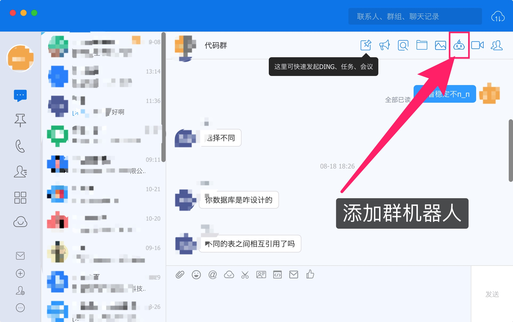
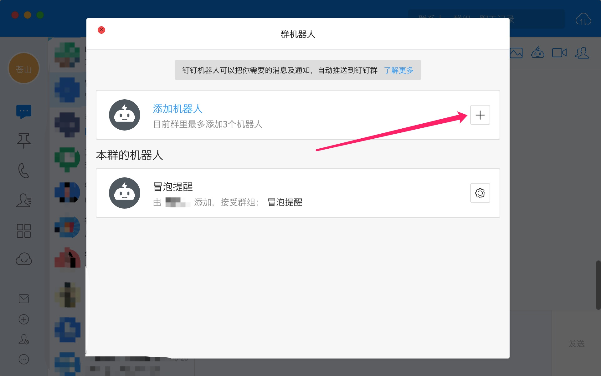
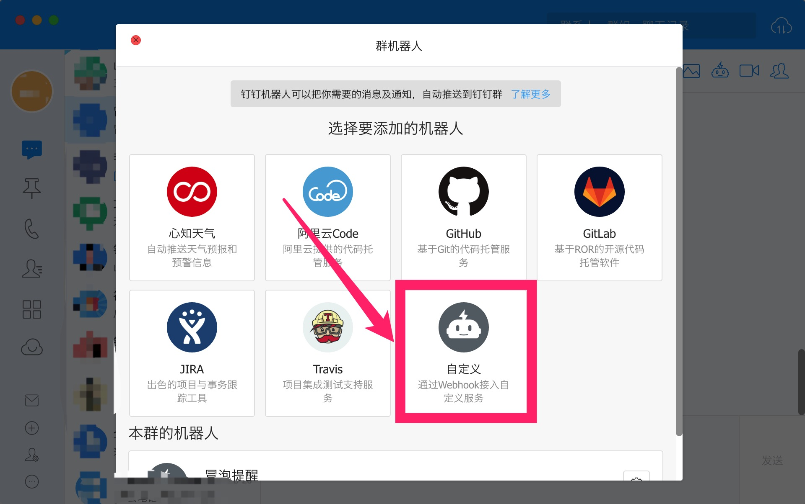
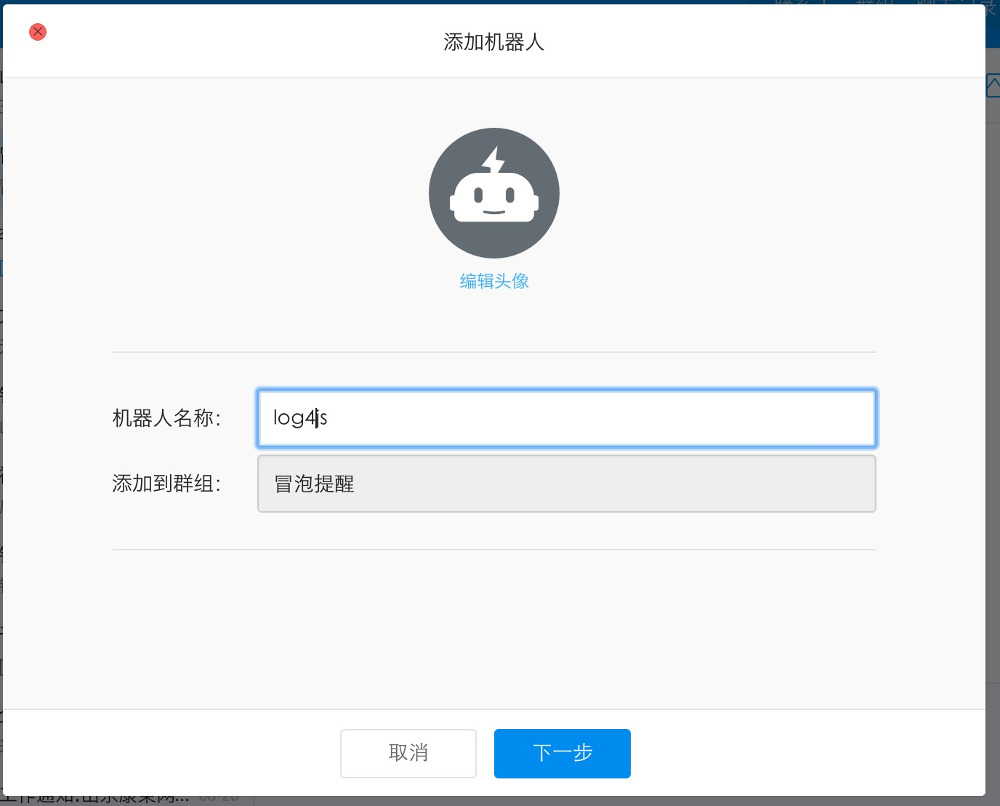
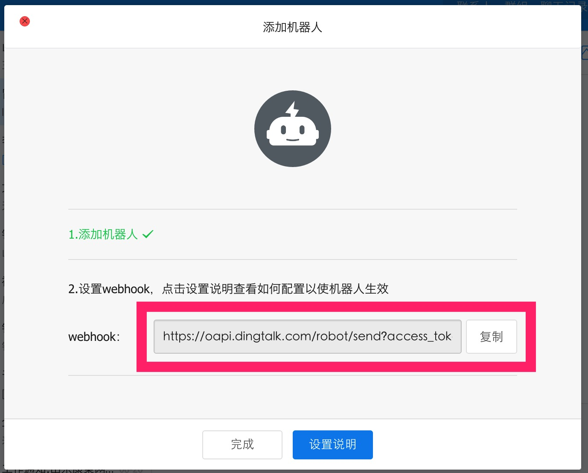
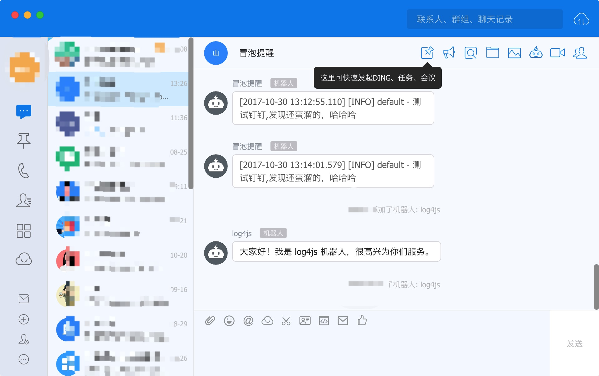

## 安装

`npm install --save log4jsdd`

## 配置 log4js

```js

    const log4js = require('log4js');
    log4js.configure({
        appenders: {
            out: { type: 'stdout'},
            dingding: {
                type: 'log4jsdd',
                hookUrl: '填写获取钉钉里面设置的 webhook 地址',
                title: 'Node 消息'
            }
        },
        categories: { default: { appenders: ['out', 'dingding'], level: 'debug' }}
    });
    
    let app = log4js.getLogger();
    app.info('测试发送到钉钉');

```
## 钉钉机器人配置






